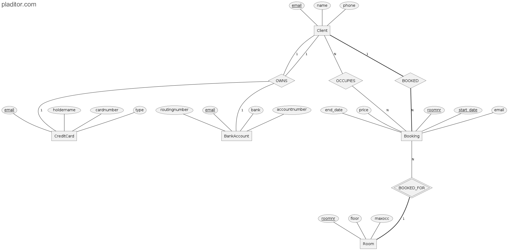

<div align="center">

</div>

HotelGenie is a comprehensive hotel management system designed to streamline the processes of hotel booking, room creation, user management, and reservations. This project utilizes cutting-edge technologies such as Java, Spring Boot, Next.js, Redis, and PostgreSQL to provide a secure, scalable, and user-friendly experience.

---

## 🌐 Frontend Repository
The frontend code for HotelGenie is located at: [https://github.com/seraph159/hotel-genie-frontend](https://github.com/seraph159/hotel-genie-frontend)

---

## 🌟 Features

### 🔐 User Management
- ✅ Secure authentication and authorization using **Spring Security** with JWT.
- 👥 **Role-based access control** for administrators and customers.

### 🏨 Hotel Management
- 🏠 **Efficient room creation** and management.
- 📊 **Real-time availability tracking** and reservation processes.

### 💳 Payment Integration
- 💰 Seamless **payment processing** using **Stripe**, complete with custom webhooks.
- ⚡ **Enhanced transaction speed** by **40%**.

### 🤖 AI-Powered Recommendations
- 🎯 **Personalized hotel room recommendations** using **OpenAI models**.
- 😊 **Improved user satisfaction** through tailored suggestions.

### ⚡ Performance Optimization
- 🚀 **Redis caching** is used to **reduce response times**, **validate tokens for login**, and **improve scalability**.

---

## 🛠 Technologies Used

### Backend
- **Java**: Core language for backend logic.
- **Spring Boot**: Framework for creating RESTful APIs and managing the backend.
- **Spring Security**: For secure authentication and authorization.
- **Hibernate**: ORM tool for database interactions.

### Frontend
- **Next.js**: Framework for building a fast and interactive user interface.
- **React.js**: For dynamic and responsive components.

### Database & Cache
- **PostgreSQL**: For robust and scalable data storage.
- **Redis**: Caching layer to optimize query response times.

### Payment Integration
- **Stripe**: For secure and efficient payment processing.

### AI Integration
- **OpenAI Models**: For personalized recommendations.

---

## 🏁 Getting Started

### Prerequisites
- Java 17+
- Node.js 18+
- PostgreSQL 14+
- Docker
- AWS account (optional for deployment)

### 📥 Installation

1. **Clone the repository:**
   ```bash
   git clone https://github.com/seraph159/hotel-genie.git
   cd hotel-genie
   ```

2. **Set up the backend:**
   ```bash
   cd hms_backend
   ./mvnw clean install
   ```
   - 🛠 Configure `src/main/resources/application.properties` for **PostgreSQL, Redis, and Stripe credentials**.

3. **Set up the frontend:**
   ```bash
   cd ../hms_frontend
   npm install
   npm run build
   ```

4. **Run the backend:**
   ```bash
   cd ../hms_backend
   ./mvnw spring-boot:run
   ```

5. **Run the frontend:**
   ```bash
   cd ../hms_frontend
   npm run dev
   ```

6. **Access the application:**
   - 🌍 **Frontend:** `http://localhost:3000`
   - 🔗 **Backend APIs:** `http://localhost:8080`

---

## 📊 ER Diagram

Below is the entity-relationship diagram of the database architecture:



---

## 📌 API Documentation

The system exposes **30+ RESTful APIs** for managing various features.

You can explore the **API documentation** using **Swagger UI**:
- 📄 **URL:** `http://localhost:8080/swagger-ui/index.html`

---

## 🔑 Mock Login Credentials

### Admin
- **Username:** `admin@hotelgenie.com`
- **Password:** `password123`

### Client
- **Username:** `client@hotelgenie.com`
- **Password:** `password123`

---

## 🤝 Contributing

Contributions are welcome! Please follow these steps:

1. Fork the repository.
2. Create a new branch:
   ```bash
   git checkout -b feature-name
   ```
3. Commit your changes:
   ```bash
   git commit -m "Add new feature"
   ```
4. Push the branch:
   ```bash
   git push origin feature-name
   ```
5. Create a pull request.

---

## 📜 License

This project is licensed under the Apache-2.0 License. See the [LICENSE](LICENSE) file for details.

---

## 🙌 Acknowledgments

- **Spring Boot** team for their incredible framework.
- **Stripe** for seamless payment integration.
- **OpenAI** for providing innovative AI solutions.
